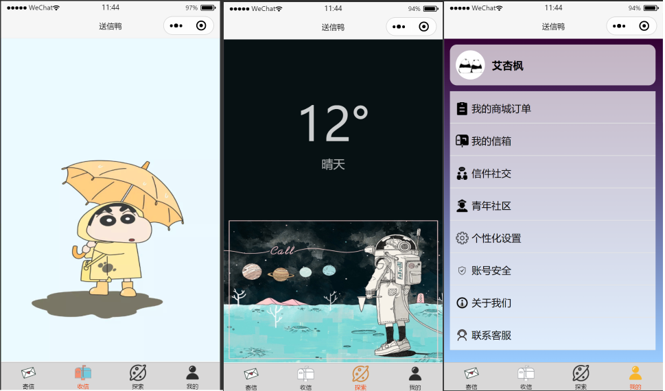

<h1 align = "center">Hackathon比赛项目</h1>
<h3 align = "center">——“送信鸭”小程序</h3>
这里是 Hackathon 2020参赛队伍私有仓库：

## 队伍名：“觉醒吧，猎杀时刻！”

## 作品名称：“送信鸭” 

## 作品介绍：

​	这是一个可以邮寄、接受实物、电子信件、明信片等的微信小程序，我们将传统的“信件物流”也与现代的“信息交流”结合，创新性提出“信件交流新纪元”。   

​	您可以在这里给现实中的朋友邮寄信件、明信片等，并实时监控信件路程，还可以查询自己有没有该收的信件；您还可以在这里给好友写电子信件、明信片、生日贺卡等；还有好多漂亮的邮票、信封等着你去积攒哦！

​	后期我们还会推出陌生人写信社交、树洞分享故事、青年社区等精彩版块，期待您的加入！

## 作品预览：

    
    <h3 align ="center">图 1-1</h3>

	

## 关于本仓库
   	本仓库为本次比赛新建的临时仓库，后期在开发和维护“送信鸭”微信小程序时，将会移到别的仓库，不过您可以通过下方的链接到达我的<a href= "https://github.com/payiz-asj">GitHub主页 </a>

