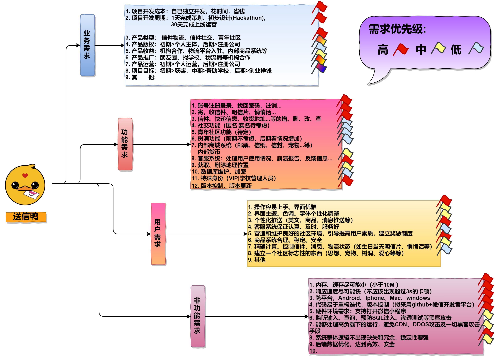

<h1 align = "center">项目需求分析</h1>
<h3 align = "center">——“送信鸭”小程序</h3>
## 1. 需求获取 / 需求调研：

### 1.1 访谈
​	访谈法获取需求是需求获取方法中最直接、最快速的一种方法了，往往能够**最直接、最具体、清晰、客观地**了解目标用户的需求。   
#### 1.1.1 用户访谈
​	我们首先来到学校宿舍楼01栋值班室，与值班的阿姨们聊天，对她们进行了访谈，因为他们是这个项目的目标用户之一，而且这个项目立项也是受她们启发。   
​	我们利用大约一个小时的访谈，获取了以下11条需求：   

```python
1. 希望能够有效地分发值班室收到的信件
2. 需要能够寄信，寄明信片
3. 能够添加、删除、修改、查询信件
4. 需要有一定的隐蔽性，学生的姓名、学号呀、手机号啊之类的信息不能泄露
5. 平台最好是手机APP或者小程序，其他的东西我们学不会
6. 能够添加、修改、删除个人收货地址
7. 学校宿管人员是否有特殊的身份可以进行普通用户以外的功能？
8. 能够自动更新版本，不过最好不要太频繁，或者更新速度快一些
9. 有使用说明，或者良好的导航栏，容易上手
10. APP体积不要太大，手机内存吃不消
11. 字体能够调整，界面颜色也能调整就更好啦
```
#### 1.1.2 开发人员访谈
​	用户访谈往往只能获取一些表面化的功能性需求，而开发人员访谈能够获得比**较全面、明确、技术化**的需求。   
​	因此我们进行了一次开发人员访谈，因为时间有限，我们就只采用了队内开发人员充当不同领域的开发人员进行模拟访谈。包括以下角色：   
​		艾山江（队长）：访谈人、记录人员   
​		郭庭：被访谈人，前端工程师   
​		艾尔肯：被访谈人，后端工程师   
​		阿卜杜拉：被访谈人，测试工程师   

​	经过一个小时的访谈及讨论，又得到了以下需求：   

```python
1. 界面优雅、操作易懂、不含广告
2. 考虑到目标用户、市场、跨平台性(不考虑Linux)，最好是开发一个微信小程序
3. 相应速度必须快，软件包不能太大，代码易于重构迭代，版本控制
4. 后端数据需要清晰、高效率的数据库，并考虑部分数据采取保密措施
5. 需要收集使用情况、崩溃报告信息、用户主动反馈消息
6. 输入框提供良好的编辑操作
7. 文字的可复制性
8. 查询功能的范围->信件标题||内容,全局搜索
9. 页面跳转逻辑合理
10. 具有最低硬件环境要求，并检测不符合的硬件给出提示
11. 利用github进行本本管理
12. 对用户输入进行检测和反馈，提高鲁棒性
13. 搜索栏、查询功能需要防止SQL注入、渗透测试等黑客攻击
14. 能够预防CDN攻击、DDOS攻击及一切黑客攻击手段
15. 产品的推广能力需要强一点
16. 适当提供用户个性化定制操作（包括设置、图样、文字、消息推送等）
```
### 1.2 市场调研 / 同类产品的需求文档    
​	市场调研的优点在于数据的**真实性、时效性**，能够根据市场的现状得到**真实、最新的需求**。   
​	然而，我们的“送信鸭”这个产品属于创新项目、市场上没有与之直接对应的已有产品做参考。但是，将我们把“送信鸭”的服务内容拆开为“物流”和“社交”两个方面以后就有很多已有的产品做参考了！   
​	目前各个小程序寄主平台(微信、QQ、支付宝、头条、百度)，对于小程序还没有出现评分、评论体系，因此，我们退而求次，准备通过类似产品，即移动应用（APP）的评分、评论得到市场上关于我们这个产品的需求。   
​	我们选取了以下三个APP进行分析：  

```python
    《邮政EMS》 ：典型信件物流      
    《给未来写封信》：典型信件树洞      
    《过客 Gorkor 》：典型信件社交      
```
​	考虑到这些APP的技术团队没有（**不可能**）提供他们开发时的需求文档，所以我们准备利用爬虫技术爬取这些APP的用户评论数据，从用户评论里得到用户需求。  

​	选择评论数据来源：**华为应用市场**（国内市场用户量最大的安卓应用商店）   
#### 1.2.1 具体过程   
​	由队长艾山江独立写python代码完成此部分工作。  

```python
1. 爬取数据：直接写python代码爬虫，或者利用八爪鱼、后裔采集器等信息采集工具，或者 寻找APP数据统计服务平台等。爬取结果用pandas库写入csv文件。  

2. 提取目标数据段:从评论数据（评论人，评分星级、评论时间、APP版本号、用户机型、评论内容）中，分理出“评分星级”和“评论内容”。  
    
3. 清洗数据：  
​	2.1 初步清洗 ：过滤重复内容以及评论字数小于7的评论   
​	2.2 深度过滤 ：
		2.2.1 利用“语气词词库”、“暴力、涉政、敏感词词库”等词库进行匹配、过滤；  
​	    2.2.2 利用NLP技术对评论内容进行情感极性分析、内容识别、文本分类，以便过滤掉无关、广告、舆情等不良评论。（这次比赛因时间太短，训练数据集来不及，因而此项暂未被启用）  

4. 词频统计：利用stylecloud(wordcloud的扩展)库进行词频统计并输出词云，结果如下图1-1

```
#### 1.2.1 调研结果  

​		需求调研结果用词云来表示如下:

<p>
    
    <h3 align ="center">图 1-1</h3>
</p>		
​		因为时间太紧张，有些语气词没能完全过滤率掉，导致真正的关于功能的需求频率太小图片里看不清。   
​		经过查看本地词频统计结果，我们又大致得到了一下需求及需要考虑的问题：  

```python
1. 收不到验证码，一直都没有办法注册
2. 良心社区，笔友素质高，
3. 界面简洁，色调舒服
4. 想要那种只自己一个人说话一个人看的私密空间
5. 总说登录过期啦？明明一天时间都没有到
6. 纷扰的世界里少有的宁静，心甘情愿氪金（我们觉得应该是合理的商业化指向，即不要盲目收费，先搞好社区气氛，再适当地提供有偿的精美道具、模板之类的内部商品）
7. 客服对线和管理的水平令人不适！
8. 每次登录都要验证码 麻烦了;希望什么时候可以加一个密码登录。
9. 可以帮笔友买邮票吗？买邮票的地方有个选项是为谁购买;可是选了笔友的名字买了以后还在我这？？
10. 收到这信的时候; 还活着。三年时间了
11. 如果能选具体的收信时间更好(这个需求超级棒，这样可以定制生日礼物明信片！当天送达！这也可以是一个新的商业化价值)
12. 商城买的快递拒收后返运堪称蜗牛速度。客服都问不了;投诉不了;故意逃避责任？以后商城再给 发EMS 就不买华为了！！
13. 所谓的官方快递;包装如此简陋；看看顺丰;请正视差距;
14. 一点击“网点查询”就闪退
15. 没人来收;就显示已揽收，无奈！！！
16. 新用户还可以获得十元红包？！！哇
17. 本根点不开寄件
18. 四天前寄出的东西到 还查不到物流信息; 也是醉了-_-
19. ...
20. 一共9277条

```
​	数量及其庞大！！但是需求分类可以解决这个问题。

## 2. 需求分类及优先级评定：  
​	为了更精确地简化需求，我们进行了需求分类和优先级评定，对上述访谈和市场调研结果，参考国内软件需求分析人员常用的几个需求分类和等级分类，进行队内投票计算平均值的方式得到了本次项目的最终需求及需求优先级。  
​	为了不浪费时间，我就省略过程介绍，直接把结果放出来吧！请看下图1-2：

<p>
    
    <h3 align ="center">图 1-2</h3>
</p>
## 3. 未来要完成的工作   
​	获得了我们本次项目的需求以后，接下来可以进行：  
​        * 需求开发：建模、撰写需求文档  
​        * 需求管理：升级、维护  
​        * 这些是以后的事儿啦，我们现在时间有限，就开始写代码吧！   

## 4.需求分析时用到的技术和轮子
​	知识及技术：大三、大四选修课程学到的知识《软件需求分析》、《软件工程》、《软件测试》、《程序设计语言》  
   轮子：python自学了两年了，现在还在学，主要对爬虫、NLP感兴趣，也想过学一下ML,但是奈何自己数学不太好，学不进去，本次需求分析用到的代码，一部分是我在2020年03月-2020年06月撰写我的毕业论文《应用商店应用评分机制研究》，今天再改了改，维护了一下就重新用了。

## 4.心酸往事     

​	本需求分析完档编写于从2020-11-28 12:00 到 2020-11-29 04:38，花费了这次比赛规定的24小时中的16个小时，几乎一半以上，可能我有点完美主义吧，不过需求分析真的是软件开发最重要的一环，~~我还可以更加优化的~~~~呜呜，算了抓紧时间写前端去，拜拜！

​        


